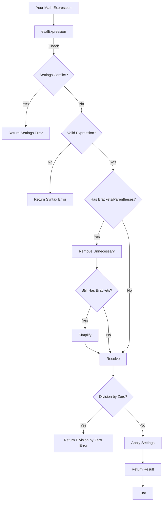

# zadcalc

A powerful JavaScript library for evaluating mathematical expressions with support for fractions, decimal precision control, and customizable output formatting.

## Features

- 🧮 Evaluates complex mathematical expressions
- 🔢 Supports fractions and decimal numbers
- 📏 Configurable decimal precision
- ➗ Automatic fraction simplification
- 🎯 Handles nested brackets (`{}`, `[]`, `()`)
- ✨ Implicit multiplication support
- 🎨 Customizable output formatting

## Installation

```bash
npm install zadcalc
```

## Usage

```javascript
const mathResolver = require('zadcalc');

// Basic usage
console.log(mathResolver.evalExpression('2+2'));  // Output: "4"
console.log(mathResolver.evalExpression('1/2'));  // Output: "0.5"

// Using fraction mode
mathResolver.settings.frac_mode = true;
console.log(mathResolver.evalExpression('1/2'));  // Output: "1/2"

// Repeating decimals
mathResolver.settings.frac_mode = true;
console.log(mathResolver.evalExpression('3.106227106227106227'));  // Output: "848/273"

// Complex expressions
console.log(mathResolver.evalExpression('{2*[3+4*(5-2)]-1}/3'));  // Output: "9.66667"
```

## Settings

You can customize the behavior using the following settings:

| Setting | Type | Default | Description |
|---------|------|---------|-------------|
| `to_fixed` | number | 5 | Number of decimal places in results |
| `frac_mode` | boolean | false | Enable fraction output mode |
| `positive_sign` | boolean | false | Show '+' for positive numbers |
| `return_as_string` | boolean | true | Return results as strings |

```javascript
// Customize settings
mathResolver.settings = {
    to_fixed: 2,           // Show 2 decimal places
    frac_mode: true,       // Enable fraction mode
    positive_sign: true,   // Show positive signs
    return_as_string: true // Return results as strings
};
```

## Examples

### Basic Operations with default setting
```javascript
mathResolver.evalExpression('1+1')      // "2"
mathResolver.evalExpression('10-5')     // "5"
mathResolver.evalExpression('4*3')      // "12"
mathResolver.evalExpression('15/3')     // "5"
```

### Decimal Operations
```javascript
mathResolver.settings.to_fixed = 2;
mathResolver.evalExpression('1.5+2.3')  // "3.80"
```

### Fraction Mode
```javascript
mathResolver.settings.frac_mode = true;
mathResolver.evalExpression('1/4')      // "1/4"
mathResolver.evalExpression('3/6')      // "1/2"  // Automatic simplification
```

### Complex Expressions
```javascript
mathResolver.evalExpression('{2*[3+4]}/2')  // "7"
mathResolver.evalExpression('2(3)')         // "6"  // Implicit multiplication
```

### Formatting Options
```javascript
// Show positive signs
mathResolver.settings.positive_sign = true;
mathResolver.evalExpression('5')  // "+5"

// Return as number
mathResolver.settings.return_as_string = false;
mathResolver.evalExpression('5')  // 5 (number type)
```

## Error Handling

The library provides clear error messages for invalid inputs:

```javascript
// Syntax errors
mathResolver.evalExpression('2++2')  // "Sintax Error"

// Division by zero
mathResolver.evalExpression('1/0')   // "Error! division by zero"

// Settings conflicts
mathResolver.settings.frac_mode = true;
mathResolver.settings.return_as_string = false;
mathResolver.evalExpression('1/2')   // "Settings Error! frac mode just work when return_as_string is true"
```

## Supported Operations

- Basic arithmetic: `+`, `-`, `*`, `/`
- Parentheses: `()`, `[]`, `{}`
- Decimal numbers including repeating decimal ones
- Fractions
- Implicit multiplication (e.g., `2(3)` equals `2*3`)
- Negative numbers

## Limitations

- Fraction mode requires `return_as_string` to be `true`
- Positive sign display requires `return_as_string` to be `true`
- Scientific notation is not supported

## Testing

The library includes a comprehensive test suite. To run the tests:

```bash
npm test
```
## Flowchart of Execution

Below is a flowchart explaining how `zadcalc` processes expressions:





## Contributing

Contributions are welcome! Please feel free to submit a Pull Request.

## License

This project is licensed under the MIT License - see the LICENSE file for details.

## Support

If you encounter any issues or have questions, please file an issue on the GitHub repository.