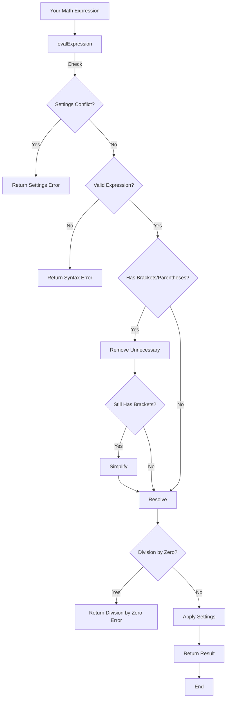

# zadcalc

A powerful JavaScript library for evaluating mathematical expressions with support for fractions, decimal precision control, and customizable output formatting.

## Features

- 🧮 Evaluates complex mathematical expressions
- 🔢 Supports fractions and decimal numbers
- 📏 Configurable decimal precision
- ➗ Automatic fraction simplification
- 🎯 Handles nested brackets (`{}`, `[]`, `()`)
- ✨ Implicit multiplication support
- 🎨 Customizable output formatting

## Prerequisites

Before installing zadcalc, ensure you have Node.js and npm installed on your system:

1. Install Node.js from [nodejs.org](https://nodejs.org/)
2. Verify your installation in terminal::
   ```bash
   node -v
   npm -v
   ```
3. Create a new Node.js project (if you haven't already):
   ```bash
   mkdir my-project
   cd my-project
   npm init -y
   ```

## Installation

Install zadcalc using npm:

```bash
npm install zadcalc
```

## Getting Started

1. Create a new JavaScript file (e.g., `index.js`)
2. Import and use zadcalc:

```javascript
const mathResolver = require('zadcalc');

// Try some basic calculations
console.log(mathResolver.evalExpression('2+2'));  // Output: "4"
console.log(mathResolver.evalExpression('1/2'));  // Output: "0.5"
```

## Usage Examples

### Basic Operations
```javascript
const mathResolver = require('zadcalc');

// Simple arithmetic
console.log(mathResolver.evalExpression('1+1'));      // "2"
console.log(mathResolver.evalExpression('10-5'));     // "5"
console.log(mathResolver.evalExpression('4*3'));      // "12"
console.log(mathResolver.evalExpression('15/3'));     // "5"

// Complex expressions
console.log(mathResolver.evalExpression('{2*[3+4*(5-2)]-1}/3'));  // "9.66667"
```

### Working with Fractions
```javascript
const mathResolver = require('zadcalc');

// Enable fraction mode
mathResolver.settings.frac_mode = true;
mathResolver.settings.return_as_string = true;  // Required for fraction mode

console.log(mathResolver.evalExpression('1/4'));      // "1/4"
console.log(mathResolver.evalExpression('3/6'));      // "1/2"  // Automatic simplification
console.log(mathResolver.evalExpression('3.106227106227106227')); // "848/273"
```

### Customizing Output
```javascript
const mathResolver = require('zadcalc');

// Configure decimal places
mathResolver.settings.to_fixed = 2;
console.log(mathResolver.evalExpression('1.5+2.3'));  // "3.80"

// Show positive signs
mathResolver.settings.positive_sign = true;
mathResolver.settings.return_as_string = true;  // Required for positive signs
console.log(mathResolver.evalExpression('5'));  // "+5"
```

## Settings

Customize zadcalc's behavior using these settings:

| Setting | Type | Default | Description |
|---------|------|---------|-------------|
| `to_fixed` | number | 5 | Number of decimal places in results |
| `frac_mode` | boolean | false | Enable fraction output mode |
| `positive_sign` | boolean | false | Show '+' for positive numbers |
| `return_as_string` | boolean | true | Return results as strings |

## Future Features

Exciting features planned for future releases:

### Advanced Mathematical Operations
- ⚡ Exponentiation (powers and roots)
- 📊 Scientific notation support
- ⚗️ Root extraction

### Matrix Operations
- 📐 Basic matrix arithmetic
- 🎯 Determinant calculation
- ⚖️ Matrix transformations

### Advanced Mathematics
- 📈 Polynomial operations
- ⚡ Equation solving
- 🔄 Limit computation
- 📊 Derivative calculation
- ∫ Integral computation

### Additional Planned Features
- 📐 Trigonometric functions
- 🎯 Complex number support
- 📊 Statistical functions
- 🔄 Vector operations
- 📈 Graphing capabilities

## Error Handling

The library provides clear error messages:

```javascript
// Syntax errors
mathResolver.evalExpression('2++2')  // "Sintax Error"

// Division by zero
mathResolver.evalExpression('1/0')   // "Error! division by zero"

// Settings conflicts
mathResolver.settings.frac_mode = true;
mathResolver.settings.return_as_string = false;
mathResolver.evalExpression('1/2')   // "Settings Error! frac mode just work when return_as_string is true"
```

## Flowchart of Execution

Below is a flowchart explaining how `zadcalc` processes expressions:



## Testing

Run the test suite:

```bash
npm test
```

## Contributing

Contributions are welcome! Please feel free to submit a Pull Request.

## License

This project is licensed under the [CC BY-NC 4.0 License](https://creativecommons.org/licenses/by-nc/4.0/) - see the LICENSE file for details.

## Support

If you encounter any issues or have questions, please file an issue on the GitHub repository.