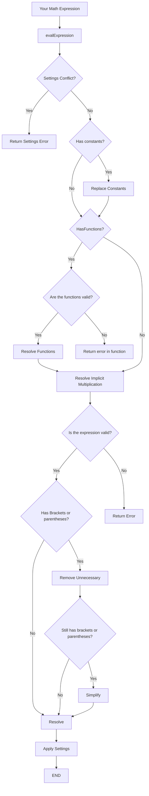

# zadcalc

[](https://www.npmjs.com/package/zadcalc)
[](https://creativecommons.org/licenses/by-nc/4.0/)
[](./README.pt-BR.md)

A powerful JavaScript library for evaluating mathematical expressions with support for fractions, trigonometric functions, LaTeX input, and customizable output formatting.

## Features

- 🧮 Evaluates complex mathematical expressions
- 🔢 Supports fractions and decimal numbers with repeating decimals
- 📐 Comprehensive trigonometric and hyperbolic functions
- 📏 Configurable decimal precision and scientific notation
- ➗ Automatic fraction simplification
- 🎯 Handles nested brackets (`{}`, `[]`, `()`)
- ✨ Implicit multiplication support
- 📝 LaTeX input support
- 🎨 Customizable output formatting
- ⚡ Exponentiation and root extraction
- 📦 CommonJS and ES6 module support

## Prerequisites

Before installing zadcalc, ensure you have Node.js and npm installed on your system:

1. Install Node.js from [nodejs.org](https://nodejs.org/)
2. Verify your installation in terminal:
   ```bash
   node -v
   npm -v
   ```
3. Create a new Node.js project (if you haven't already):
   ```bash
   mkdir my-project
   cd my-project
   npm init -y
   ```

## Installation

Install zadcalc using npm:

```bash
npm install zadcalc
```

## Getting Started

### Using CommonJS (Node.js default)
```javascript
const mathResolver = require('zadcalc');

// Basic calculations
console.log(mathResolver.evalExpression('2+2'));        // "4"
console.log(mathResolver.evalExpression('sin(30)'));    // "0.5"
console.log(mathResolver.evalExpression('sqrt(16)'));   // "4"
```

### Using ES6 Modules
```javascript
import mathResolver from 'zadcalc';

// Basic calculations
console.log(mathResolver.evalExpression('2+2'));        // "4"
console.log(mathResolver.evalExpression('sin(30)'));    // "0.5"
console.log(mathResolver.evalExpression('sqrt(16)'));   // "4"
```

> **Note**: To use ES6 imports, make sure your `package.json` has `"type": "module"` or use the `.mjs` file extension.

## Usage Examples

### Basic Operations
```javascript
const mathResolver = require('zadcalc');

// Arithmetic
console.log(mathResolver.evalExpression('1+1'));              // "2"
console.log(mathResolver.evalExpression('10-5'));             // "5"
console.log(mathResolver.evalExpression('4*3'));              // "12"
console.log(mathResolver.evalExpression('15/3'));             // "5"

// Exponentiation
console.log(mathResolver.evalExpression('2^8'));              // "256"
console.log(mathResolver.evalExpression('5^3'));              // "125"

// Complex expressions
console.log(mathResolver.evalExpression('{2*[3+4*(5-2)]-1}/3')); // "9.66667"
```

### Trigonometric Functions
```javascript
const mathResolver = require('zadcalc');

// Basic trigonometry (currently in degrees)
console.log(mathResolver.evalExpression('sin(30)'));    // "0.5"
console.log(mathResolver.evalExpression('cos(60)'));    // "0.5"
console.log(mathResolver.evalExpression('tan(45)'));    // "1"

// Inverse trigonometry (returns degrees)
console.log(mathResolver.evalExpression('asin(0.5)'));  // "30"
console.log(mathResolver.evalExpression('acos(0.5)'));  // "60"
console.log(mathResolver.evalExpression('atan(1)'));    // "45"

// Hyperbolic functions
console.log(mathResolver.evalExpression('sinh(1)'));    // "1.17520"
console.log(mathResolver.evalExpression('cosh(0)'));    // "1"
console.log(mathResolver.evalExpression('tanh(1)'));    // "0.76159"
```

### Roots and Powers
```javascript
const mathResolver = require('zadcalc');

// Square and cube roots
console.log(mathResolver.evalExpression('sqrt(25)'));         // "5"
console.log(mathResolver.evalExpression('cbrt(27)'));         // "3"

// Custom roots and powers
console.log(mathResolver.evalExpression('nroot(16, 4)'));     // "2"
console.log(mathResolver.evalExpression('pow(2, 10)'));       // "1024"
```

### Logarithms
```javascript
const mathResolver = require('zadcalc');

// Natural and base-10 logarithms
console.log(mathResolver.evalExpression('ln(E)'));            // "1"
console.log(mathResolver.evalExpression('log(100)'));         // "2"

// Custom base logarithms
console.log(mathResolver.evalExpression('log(8, 2)'));        // "3"
console.log(mathResolver.evalExpression('log(1000, 10)'));    // "3"
```

### Working with Fractions
```javascript
const mathResolver = require('zadcalc');

// Enable fraction mode
mathResolver.settings.frac_mode = true;
mathResolver.settings.return_as_string = true;  // Required for fraction mode

console.log(mathResolver.evalExpression('1/4'));              // "1/4"
console.log(mathResolver.evalExpression('3/6'));              // "1/2" (simplified)
console.log(mathResolver.evalExpression('0.75'));             // "3/4"

// Repeating decimals
console.log(mathResolver.evalExpression('0.333333333'));      // "1/3"
console.log(mathResolver.evalExpression('3.106227106227'));   // "848/273"
```

### LaTeX Input
```javascript
const mathResolver = require('zadcalc');

// LaTeX expressions
console.log(mathResolver.evalExpression('\\frac{1}{2}'));           // "0.5"
console.log(mathResolver.evalExpression('\\sqrt{16}'));             // "4"
console.log(mathResolver.evalExpression('\\sin(30)'));              // "0.5"
```

### Mathematical Constants
```javascript
const mathResolver = require('zadcalc');

// Using constants
console.log(mathResolver.evalExpression('PI'));              // "3.14159..."
console.log(mathResolver.evalExpression('E'));               // "2.71828..."
console.log(mathResolver.evalExpression('TAU'));             // "6.28318..."
console.log(mathResolver.evalExpression('PHI'));             // "1.61803..."

// Constants in expressions
console.log(mathResolver.evalExpression('2*PI'));            // "6.28318..."
console.log(mathResolver.evalExpression('E^2'));             // "7.38906..."
```

### Scientific Notation
```javascript
const mathResolver = require('zadcalc');

// Note: lowercase 'e' is for scientific notation
console.log(mathResolver.evalExpression('1.5e3'));           // "1500"
console.log(mathResolver.evalExpression('2.5e-2'));          // "0.025"
console.log(mathResolver.evalExpression('1e6 + 1e3'));       // "1001000"

// Uppercase 'E' is the Euler constant
console.log(mathResolver.evalExpression('E'));               // "2.71828..."
```

### Customizing Output
```javascript
const mathResolver = require('zadcalc');

// Configure decimal places
mathResolver.settings.to_fixed = 2;
console.log(mathResolver.evalExpression('1.5+2.3'));         // "3.80"

// Show positive signs
mathResolver.settings.positive_sign = true;
mathResolver.settings.return_as_string = true;
console.log(mathResolver.evalExpression('5'));               // "+5"

// Scientific notation
mathResolver.settings.to_fixed = 3;
console.log(mathResolver.evalExpression('1000000'));         // "1.000e+6"
```

## Module System Support

zadcalc supports both CommonJS and ES6 module systems out of the box.

### CommonJS (require)
The traditional Node.js way:

```javascript
const mathResolver = require('zadcalc');
console.log(mathResolver.evalExpression('2+2'));  // "4"
```

### ES6 Modules (import)
Modern JavaScript syntax:

```javascript
import mathResolver from 'zadcalc';
console.log(mathResolver.evalExpression('2+2'));  // "4"
```

**To use ES6 imports in Node.js:**

1. Add `"type": "module"` to your `package.json`:
   ```json
   {
     "type": "module",
     "dependencies": {
       "zadcalc": "^3.0.0"
     }
   }
   ```

2. Or use the `.mjs` extension for your files:
   ```bash
   # Your file: calculator.mjs
   import mathResolver from 'zadcalc';
   ```

The package automatically detects which module system you're using and loads the appropriate version.

## Supported Functions

### Trigonometric Functions (Degrees)
| Function | Aliases | Description | Example |
|----------|---------|-------------|---------|
| `sin(x)` | `sen(x)` | Sine | `sin(30)` → `0.5` |
| `cos(x)` | - | Cosine | `cos(60)` → `0.5` |
| `tan(x)` | `tg(x)` | Tangent | `tan(45)` → `1` |
| `asin(x)` | `asen(x)` | Arc sine | `asin(0.5)` → `30` |
| `acos(x)` | - | Arc cosine | `acos(0.5)` → `60` |
| `atan(x)` | `atg(x)` | Arc tangent | `atan(1)` → `45` |

> **Note**: Trigonometric functions currently work in degrees only. Radian support will be added in a future update via configuration.

### Hyperbolic Functions
| Function | Aliases | Description | Domain |
|----------|---------|-------------|--------|
| `sinh(x)` | `senh(x)` | Hyperbolic sine | All real numbers |
| `cosh(x)` | - | Hyperbolic cosine | All real numbers |
| `tanh(x)` | `tgh(x)` | Hyperbolic tangent | All real numbers |
| `asinh(x)` | - | Inverse hyperbolic sine | All real numbers |
| `acosh(x)` | - | Inverse hyperbolic cosine | x ≥ 1 |
| `atanh(x)` | `atgh(x)` | Inverse hyperbolic tangent | -1 < x < 1 |

### Roots and Powers
| Function | Description | Example | Limitations |
|----------|-------------|---------|-------------|
| `sqrt(x)` | Square root | `sqrt(16)` → `4` | x ≥ 0 |
| `cbrt(x)` | Cube root | `cbrt(27)` → `3` | All real numbers |
| `nroot(x, n)` | Nth root | `nroot(16, 4)` → `2` | Even n requires x ≥ 0 |
| `pow(base, exp)` | Power | `pow(2, 8)` → `256` | See notes below |
| `x^y` | Exponentiation | `2^8` → `256` | See notes below |

> **Power Limitations**:
> - 0^0 returns domain error (mathematically indeterminate)
> - Negative bases with non-integer exponents return domain error
> - Results must be finite

### Logarithms and Exponentials
| Function | Description | Example | Domain |
|----------|-------------|---------|--------|
| `ln(x)` | Natural log (base e) | `ln(E)` → `1` | x > 0 |
| `log(x)` | Base-10 logarithm | `log(100)` → `2` | x > 0 |
| `log(x, base)` | Custom base log | `log(8, 2)` → `3` | x > 0, base > 0, base ≠ 1 |
| `exp(x)` | Exponential (e^x) | `exp(1)` → `2.71828` | Result must be finite |

### Other Functions
| Function | Aliases | Description | Limitations |
|----------|---------|-------------|-------------|
| `abs(x)` | - | Absolute value | None |
| `factorial(n)` | `fact(n)` | Factorial | 0 ≤ n ≤ 170, n must be integer |
| `max(a, b)` | - | Maximum value | None |
| `min(a, b)` | - | Minimum value | None |

## Mathematical Constants

| Constant | Symbol | Value | Description |
|----------|--------|-------|-------------|
| `E` | - | 2.718281828... | Euler's number (base of natural logarithm) |
| `PI` | `π` | 3.141592653... | Pi (ratio of circle circumference to diameter) |
| `TAU` | `τ` | 6.283185307... | Tau (2π, full circle in radians) |
| `PHI` | `φ`, `ϕ` | 1.618033988... | Golden ratio |

> **Important**: Uppercase `E` is the Euler constant. Lowercase `e` is used for scientific notation (e.g., `1.5e3` = 1500).

## Settings

Customize zadcalc's behavior using these settings:

| Setting | Type | Default | Description |
|---------|------|---------|-------------|
| `to_fixed` | number | 5 | Number of decimal places in results |
| `frac_mode` | boolean | false | Enable fraction output mode |
| `positive_sign` | boolean | false | Show '+' for positive numbers |
| `return_as_string` | boolean | true | Return results as strings (required for `frac_mode` and `positive_sign`) |

### Examples
```javascript
const mathResolver = require('zadcalc');

// Access and modify settings
mathResolver.settings.to_fixed = 3;
mathResolver.settings.frac_mode = true;
mathResolver.settings.positive_sign = false;
mathResolver.settings.return_as_string = true;
```

## Error Handling

The library provides clear error messages for various scenarios:

### Syntax Errors
```javascript
mathResolver.evalExpression('2++2')       // "Syntax Error"
mathResolver.evalExpression('(2+3')       // "Syntax Error"
```

### Domain Errors
```javascript
mathResolver.evalExpression('sqrt(-1)')   // Domain error (no complex numbers)
mathResolver.evalExpression('ln(-5)')     // Domain error (log of negative)
mathResolver.evalExpression('0^0')        // Domain error (indeterminate)
mathResolver.evalExpression('asin(2)')    // Domain error (outside [-1, 1])
```

### Division by Zero
```javascript
mathResolver.evalExpression('1/0')        // "Error! division by zero"
mathResolver.evalExpression('5/(3-3)')    // "Error! division by zero"
```

### Settings Conflicts
```javascript
mathResolver.settings.frac_mode = true;
mathResolver.settings.return_as_string = false;
mathResolver.evalExpression('1/2')        
// "Settings Error! frac mode just works when return_as_string is true"
```

### Complex Numbers
> **Note**: zadcalc does not support complex numbers. Operations that would result in complex numbers (like `sqrt(-1)`) will return domain errors.

## Flowchart of Execution

Below is a flowchart explaining how zadcalc processes expressions:



## Breaking Changes in v3.0.0

### New Features
- ✨ Full LaTeX input support
- ⚡ Exponentiation operator (`^`)
- 📐 Complete set of trigonometric and hyperbolic functions
- 🔢 Improved fraction mode with repeating decimal support
- 🎯 Domain validation for all mathematical functions
- 📦 Native ES6 module support with automatic detection

### Behavior Changes
- Trigonometric functions now work exclusively in **degrees** (radian mode coming in future update)
- Improved implicit multiplication detection
- Enhanced error messages with domain-specific errors
- Better handling of scientific notation vs Euler constant (e vs E)

## Roadmap

### Coming Soon
- 🎯 **Degree/Radian Toggle** - Configuration to switch between degree and radian modes for trigonometric functions

### Future Features
- 📊 Matrix operations (basic arithmetic, determinants, transformations)
- 📈 Polynomial operations and equation solving
- 🔄 Limit computation
- 📊 Derivative calculation
- ∫ Integral computation
- 📊 Statistical functions
- 🔄 Vector operations
- 📈 Graphing capabilities

## Testing

Run the test suite:

```bash
npm test
```

Run linter:

```bash
npm run lint
```

## Contributing

Contributions are welcome! Please feel free to submit a Pull Request.

1. Fork the repository
2. Create your feature branch (`git checkout -b feature/amazing-feature`)
3. Commit your changes (`git commit -m 'Add some amazing feature'`)
4. Push to the branch (`git push origin feature/amazing-feature`)
5. Open a Pull Request

## License

This project is licensed under the [CC BY-NC 4.0 License](https://creativecommons.org/licenses/by-nc/4.0/) - see the LICENSE file for details.

## Support

If you encounter any issues or have questions:
- 🐛 [Report bugs](https://github.com/Zadoque/zadcalc/issues)
- 💡 [Request features](https://github.com/Zadoque/zadcalc/issues)
- 📖 [View documentation](https://github.com/Zadoque/zadcalc#readme)

## Author

**Zadoque Carneiro** - [GitHub](https://github.com/Zadoque)

---

Made with ❤️ by Zadoque Carneiro
